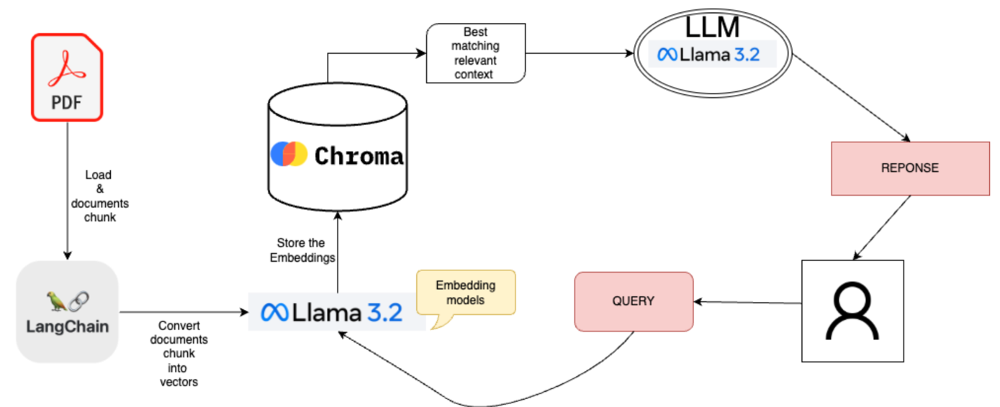

# PDF Question-Answering System

This project implements a PDF Question-Answering System that allows users to upload PDF files and ask questions about their content. The system processes the PDFs by splitting them into chunks, stores the content in a vector database (Chroma), and uses an AI language model to generate answers based on the retrieved context.

## Features

- **PDF Upload**: Easily upload a PDF file through a user-friendly Streamlit interface.
- **Document Processing**: Extract text from PDFs, split it into manageable chunks, and assign unique identifiers.
- **Vector Database**: Populate and update a Chroma vector database with document embeddings.
- **Question Answering**: Query the vector database for relevant document chunks and generate answers using an AI language model.
- **Conversation History**: Maintain a history of questions and answers for easy reference.
- **Reset Functionality**: Reset the conversation and database when needed.

## Architecture



Description de l'architecture du système...


## Project Structure

- **app.py**: The Streamlit application that provides the front-end for uploading PDFs, asking questions, and displaying the conversation history.
- **query_data.py**: Contains functions to query the vector database and generate answers based on the most relevant documents.
- **populate_database.py**: Handles loading PDF documents, splitting them into chunks, assigning unique IDs, and updating the vector database.
- **get_embedding_function.py**: Provides the embedding model used to generate embeddings for document text (using the OllamaEmbeddings model).

## Requirements

- Python 3.8+
- [Streamlit](https://streamlit.io/)
- [LangChain](https://github.com/hwchase17/langchain)
- [Chroma](https://github.com/chroma-core/chroma)
- Additional dependencies as specified in `requirements.txt` (if available)

## Setup Instructions

1. **Clone the Repository**

   ```bash
   git clone https://github.com/evauclin/Question-Answering-from-PDF.git
   cd Question-Answering-from-PDF
    ```
   
2. **Create a Virtual Environment and Install Dependencies**

   ```bash
   python -m venv venv
    source venv/bin/activate  # On Windows: venv\Scripts\activate
    pip install -r requirements.txt

   ```

3. **Run the Streamlit Application**

   ```bash
    streamlit run app.py
    ```

## Usage

- **PDF Upload a PDF File:**: On the homepage, upload your PDF file using the file uploader. The system will process the file and update the vector database.
- **Ask a Question**: After uploading a PDF, you can ask questions about the content. The system will retrieve relevant chunks and generate answers.
- **View Conversation History**: The conversation history panel displays the questions asked and the corresponding answers.
- **Reset the System**: Use the reset button to clear the conversation history and reset the vector database.
